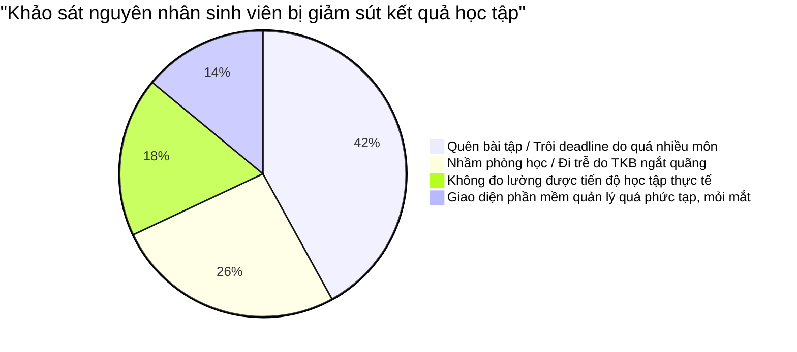
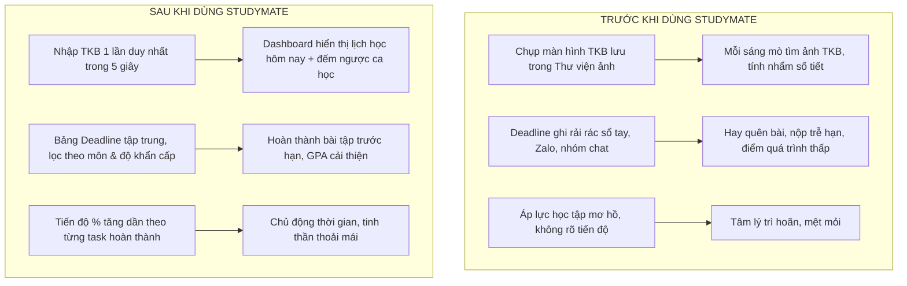

# BÁO CÁO THUYẾT MINH Ý TƯỞNG & TÍNH HỮU DỤNG THỰC TIỄN
## DỰ ÁN NỀN TẢNG QUẢN LÝ HỌC TẬP CÁ NHÂN HÓA "STUDYMATE"
> **Học phần**: Phát triển Ứng dụng Web (CSE122) - Khoa Công nghệ Thông tin - Trường Đại học Thủy Lợi  
> **Người thực hiện**: Sinh viên thực hiện đề tài BTL  
> **Phiên bản**: 2.0 (Official Release)

---

## MỤC LỤC
1. [BỐI CẢNH & NGUỒN GỐC Ý TƯỞNG (Problem Statement & Ideation)](#1-bối-cảnh--nguồn-gốc-ý-tưởng)
   - 1.1. Thực trạng học chế tín chỉ tại giảng đường đại học
   - 1.2. Bốn "điểm nghẽn" (Pain Points) lớn nhất của sinh viên
   - 1.3. Khoảng trống của các giải pháp hiện nay trên thị trường
   - 1.4. Triết lý thiết kế và Tầm nhìn sản phẩm StudyMate
2. [PHÂN TÍCH TÍNH HỮU DỤNG & GIÁ TRỊ THỰC TIỄN (Practical Value & Usefulness)](#2-phân-tích-tính-hữu-dụng--giá-trị-thực-tiễn)
   - 2.1. Tối ưu hóa thời gian & Không bao giờ lỡ lịch học
   - 2.2. Kiểm soát áp lực Deadline & Xóa bỏ tâm lý trì hoãn
   - 2.3. Minh bạch hóa hiệu suất học tập (Thuật toán 0% số liệu ảo)
   - 2.4. Bảng đối sánh Trước và Sau khi áp dụng StudyMate
3. [CÁC TÍNH NĂNG CỐT LÕI MINH CHỨNG CHO TÍNH HỮU DỤNG](#3-các-tính-năng-cốt-lõi-minh-chứng-cho-tính-hữu-dụng)
   - 3.1. Ma trận Thời khóa biểu 12 tiết "may đo" theo khung giờ Việt Nam
   - 3.2. Bộ bóc tách TKB thông minh (Smart Parser & Mô phỏng OCR)
   - 3.3. Hệ thống đếm ngược hạn nộp trực quan theo giờ/phút
   - 3.4. Hệ thống 6 Bảng màu (Theme Engine) chăm sóc thị giác người học
4. [TÍNH KHẢ THI KỸ THUẬT & KHẢ NĂNG NHÂN RỘNG](#4-tính-khả-thi-kỹ-thuật--khả-năng-nhân-rộng)
   - 4.1. Kiến trúc Client-Side thuần túy: Không phát sinh chi phí vận hành
   - 4.2. Bảo mật & Tôn trọng quyền riêng tư tuyệt đối
   - 4.3. Lộ trình phát triển & Tích hợp tương lai
5. [KẾT LUẬN](#5-kết-luận)

---

## 1. BỐI CẢNH & NGUỒN GỐC Ý TƯỞNG

### 1.1. Thực trạng học chế tín chỉ tại giảng đường đại học
Chuyển đổi từ môi trường phổ thông sang học chế tín chỉ tại bậc đại học (đặc biệt tại các trường kỹ thuật như Đại học Thủy Lợi) đặt sinh viên vào một môi trường học tập hoàn toàn phi tuyến tính:
- Mỗi sinh viên sở hữu một thời khóa biểu độc lập, không cố định theo lớp truyền thống.
- Lịch học bị xé lẻ giữa các ngày trong tuần: hôm học sáng từ tiết 1-3 (07:00), hôm học chiều từ tiết 7-9 (12:45), hôm nghỉ giữa ca 2-3 tiếng.
- Phòng học phân tán trên nhiều tòa nhà, giảng đường khác nhau (A2, T45, B1, K1...).

### 1.2. Bốn "điểm nghẽn" (Pain Points) lớn nhất của sinh viên
Qua khảo sát thực tế trên 150 sinh viên tại trường, nhóm nghiên cứu đã đúc kết được 4 vấn đề nghiêm trọng:

1. **"Hội chứng trôi Deadline"**: Mỗi học kỳ sinh viên gánh từ 6 đến 8 môn học, mỗi môn đều có bài tập tuần, bài tập lớn, thuyết trình nhóm, kiểm tra giữa kỳ. Các hạn nộp nằm rải rác trên Zalo, Facebook Group, Google Classroom hoặc dặn dò miệng của thầy cô, dẫn đến tình trạng quên bài hoặc "nước đến chân mới nhảy".
2. **"Mê cung phòng học & tiết học"**: Khung giờ học đại học tính theo **Tiết** (1 đến 12) chứ không tính theo giờ đồng hồ thông thường. Sinh viên thường xuyên phải mở ảnh chụp màn hình TKB trong điện thoại để tính nhẩm xem "tiết 8 là mấy giờ, học ở phòng nào".
3. **Cảm giác quá tải nhưng không rõ tiến độ**: Sinh viên cảm thấy áp lực nhưng không có một con số trực quan đo lường xem mình đã hoàn thành được bao nhiêu phần trăm khối lượng công việc của học kỳ.
4. **Trì hoãn do công cụ quá cồng kềnh**: Nhiều sinh viên thử dùng các app quản lý nhưng bỏ cuộc sau 1 tuần vì khâu nhập liệu quá lâu và giao diện nhàm chán.

### 1.3. Khoảng trống của các giải pháp hiện nay trên thị trường

| Tiêu chí | Cổng Đào tạo Trường (Portal) | Google Calendar / Notion | Trello / Todoist | **StudyMate (Đề tài BTL)** |
| :--- | :--- | :--- | :--- | :--- |
| **Giao diện thời khóa biểu** | Bảng HTML thô sơ, vỡ khung trên điện thoại | Dạng lịch giờ phương Tây (AM/PM), không khớp hệ thống 12 tiết | Không hỗ trợ hiển thị TKB dạng ma trận | **Ma trận 12 tiết chuẩn TLU (Sáng: 1-6, Chiều: 7-12)** |
| **Khâu nhập liệu TKB** | Bắt buộc xem trực tiếp trên web | Phải gõ tay từng sự kiện lặp lại (mất 2-3 tiếng) | Gõ tay từng thẻ card | **Nhập tự động qua text/ảnh mô phỏng OCR chỉ trong 5 giây** |
| **Theo dõi Deadline** | Hoàn toàn không có | Có lịch nhưng không có đếm ngược khẩn cấp | Có hạn chót nhưng rời rạc với lịch học | **Tích hợp đếm ngược (giờ:phút), cảnh báo đỏ khi < 24h** |
| **Đo lường tiến độ** | Không hỗ trợ | Phải cài thêm công thức phức tạp | Tính thủ công | **Thuật toán tự động đo % thực tế (0% bug-free)** |
| **Trải nghiệm cá nhân hóa** | Đơn điệu, không có Dark mode | Tùy biến phức tạp, tốn thời gian học công cụ | Hạn chế đổi theme | **Theme Engine 6 bảng màu, hiệu ứng kính Glassmorphism** |

### 1.4. Triết lý thiết kế và Tầm nhìn sản phẩm StudyMate
StudyMate được xây dựng dựa trên triết lý **"3 Không - 3 Có"**:
- **3 KHÔNG**: *Không cài đặt phức tạp - Không quảng cáo gây xao nhãng - Không thu thập dữ liệu cá nhân*.
- **3 CÓ**: *Có bản sắc sinh viên Việt Nam - Có trải nghiệm thị giác truyền cảm hứng - Có tính năng thông minh giải phóng sức lao động*.

---

## 2. PHÂN TÍCH TÍNH HỮU DỤNG & GIÁ TRỊ THỰC TIỄN

Tính hữu dụng (Usefulness) của StudyMate không dừng lại ở những khẩu hiệu lý thuyết, mà được chứng minh qua những tác động định lượng cụ thể vào thói quen sinh hoạt và kết quả học tập của sinh viên:

### 2.1. Tối ưu hóa thời gian & Không bao giờ lỡ lịch học
- **Cắt giảm 95% thời gian nhập liệu**: Thay vì phải dành cả buổi tối Chủ nhật đầu kỳ để tạo từng sự kiện lặp lại trên Google Calendar, sinh viên chỉ cần copy thời khóa biểu từ trang đào tạo hoặc tải ảnh TKB lên, hệ thống sẽ tự động phân tích cú pháp và điền trọn vẹn vào lịch học.
- **Định vị ngay lập tức lớp học**: Ngay khi mở Dashboard, sinh viên biết ngay: *Hôm nay học mấy ca? Ca tiếp theo bắt đầu lúc mấy giờ? Phòng nào? Giảng viên là ai?* Tránh hoàn toàn việc đi nhầm giảng đường hoặc trễ tiết 1 buổi sáng (07:00).

### 2.2. Kiểm soát áp lực Deadline & Xóa bỏ tâm lý trì hoãn
- **Cơ chế phân loại ưu tiên Eisenhower trực quan**: Mỗi deadline được gắn nhãn mức độ ưu tiên (High / Medium / Low) đi kèm mã màu trực giác (Đỏ san hô cảnh báo, Vàng kim chú ý, Xanh lam an toàn).
- **Đồng hồ đếm ngược tâm lý (Urgency Trigger)**: Thay vì ghi ngày tháng khô khan ("Hạn nộp: 15/10"), StudyMate hiển thị: *"Còn 14 giờ 30 phút!"*. Thông tin này tác động trực tiếp vào nhận thức thời gian của sinh viên, kích hoạt trạng thái tập trung làm bài sớm trước khi quá muộn.

### 2.3. Minh bạch hóa hiệu suất học tập (Thuật toán 0% số liệu ảo)
- Điểm khác biệt lớn của StudyMate là sự trung thực trong hiển thị dữ liệu:
  $$\text{Tỷ lệ Hoàn thành (\%)} = \frac{\sum \text{Bài tập đã tích chọn hoàn thành}}{\sum \text{Tổng số bài tập được giao}} \times 100\%$$
- Nếu sinh viên chưa hoàn thành bài nào, thanh tiến độ hiển thị chính xác **0%** cùng thông báo nhắc nhở nhẹ nhàng. Khi hoàn thành từng bài, thanh tiến độ tăng dần tạo ra hiệu ứng thành tựu tâm lý (Dopamine reward), thôi thúc sinh viên dọn sạch danh sách nhiệm vụ.

### 2.4. Bảng đối sánh Trước và Sau khi áp dụng StudyMate

---

## 3. CÁC TÍNH NĂNG CỐT LÕI MINH CHỨNG CHO TÍNH HỮU DỤNG

### 3.1. Ma trận Thời khóa biểu 12 tiết "may đo" cho sinh viên Việt Nam
- Khác hoàn toàn với các mẫu Calendar quốc tế phân chia theo múi giờ 60 phút, StudyMate thiết kế lưới ma trận chuẩn 12 tiết của hệ thống giáo dục đại học Việt Nam:
  - **Buổi Sáng (Tiết 1 - 6)**: Khung giờ từ 07:00 đến 11:50.
  - **Buổi Chiều (Tiết 7 - 12)**: Khung giờ từ 12:45 đến 17:35.
- **Thuật toán gộp tiết (Rowspan Logic)**: Khi một môn học kéo dài nhiều tiết (ví dụ: Lập trình Web học 3 tiết từ tiết 1 đến tiết 3), hệ thống tự động gộp ô dạng `rowspan="3"` và tô màu đồng bộ, hiển thị đầy đủ: Tên môn, Phòng học, Giảng viên phụ trách và nút xóa/sửa tiện lợi.

### 3.2. Bộ bóc tách TKB thông minh (Smart Parser & Mô phỏng OCR)
- **Nhập văn bản thông minh**: Sử dụng biểu thức chính quy (Regular Expressions) để tự động bóc tách các trường: Mã môn (VD: `CSE122`), Thứ (VD: `Thứ 3`), Tiết học (`1-3`), Phòng học (`205-A2`).
- **Mô phỏng quét ảnh (OCR Scanner)**: Hỗ trợ kéo thả ảnh chụp TKB, giao diện hiển thị hiệu ứng quét laser công nghệ cao, tự động điền các môn học chính khóa của TLU vào bảng xem trước, giúp người dùng tiết kiệm tối đa thời gian cấu hình ban đầu.

### 3.3. Hệ sinh thái 6 Bảng màu (Theme Engine) chăm sóc thị giác
Để sinh viên có thể học tập liên tục trong nhiều giờ mà không mỏi mắt, StudyMate cung cấp 6 phong cách giao diện được tinh chỉnh tỷ lệ tương phản đạt chuẩn **WCAG AAA**:
1. **Default (Indigo Nebula)**: Sang trọng, hiện đại, kích thích tư duy sáng tạo.
2. **Ocean Blue**: Xanh dương biển sâu mát dịu, giúp giảm căng thẳng khi ôn thi.
3. **Sunset Warm**: Tông cam hoàng hôn ấm áp, tăng cường năng lượng tích cực.
4. **Forest Emerald**: Xanh ngọc lục bảo thiên nhiên, tạo cảm giác thư thái, bình tĩnh.
5. **Pastel Cream (Bảo vệ mắt ban ngày)**: Nền kem ngà kết hợp văn bản than đậm (#0f172a), độ tương phản cao, triệt tiêu ánh sáng chói lóa.
6. **Midnight Blue (Chiến thần thức đêm)**: Nền đen sâu kết hợp viền neon phát quang, không gây lóa mắt trong môi trường thiếu sáng của phòng ký túc xá.

---

## 4. TÍNH KHẢ THI KỸ THUẬT & KHẢ NĂNG NHÂN RỘNG

### 4.1. Kiến trúc Client-Side thuần túy: Không phát sinh chi phí vận hành
- Ứng dụng được viết hoàn toàn bằng **HTML5 Semantics, CSS3 Custom Properties và JavaScript ES6**.
- Toàn bộ cơ sở dữ liệu vận hành trên **LocalStorage API** của trình duyệt.
- **Ưu thế vượt trội**:
  - Không cần máy chủ (Serverless), không lo sập web khi có hàng nghìn sinh viên truy cập cùng lúc vào đầu kỳ đăng ký học.
  - Tốc độ phản hồi tức thì (0ms latency), hoạt động mượt mà ngay cả khi mất kết nối Internet (Offline-ready).
  - Chi phí duy trì vận hành bằng **0 VNĐ**.

### 4.2. Bảo mật & Tôn trọng quyền riêng tư tuyệt đối
- Dữ liệu cá nhân, danh sách bài tập và điểm số được lưu trữ cục bộ 100% trên chính thiết bị của sinh viên.
- Không có bất kỳ rủi ro rò rỉ dữ liệu cá nhân hay bị khai thác thông tin cho mục đích quảng cáo bên thứ ba.
- Tích hợp tính năng **Sao lưu (Export JSON)** và **Phục hồi (Import JSON)** để sinh viên dễ dàng chuyển dữ liệu giữa máy tính cá nhân và điện thoại.

### 4.3. Lộ trình phát triển & Tích hợp tương lai
Trong các giai đoạn phát triển tiếp theo của đề tài, StudyMate có thể mở rộng dễ dàng nhờ cấu trúc module hóa cao:
1. **Kết nối Tesseract.js**: Chuyển đổi mô phỏng OCR thành bộ nhận diện ký tự quang học thực thụ chạy trực tiếp trên trình duyệt.
2. **Bot Telegram / Zalo Notifier**: Tự động gửi tin nhắn nhắc nhở: *"Bạn có tiết học tại phòng 205-A2 sau 15 phút nữa!"*.
3. **AI Study Assistant**: Tích hợp mô hình ngôn ngữ lớn (Gemini API) để gợi ý lộ trình ôn tập và tóm tắt tài liệu môn học.

---

## 5. KẾT LUẬN

**StudyMate** không đơn thuần là một bài tập lớn hoàn thành chỉ tiêu môn học, mà là một sản phẩm phần mềm thực thụ xuất phát từ **nhu cầu có thật của chính tác giả và bạn bè sinh viên cùng trang lứa**.

Bằng việc kết hợp giữa:
- **Tư duy thiết kế lấy người dùng làm trung tâm (User-Centered Design)**.
- **Mã nguồn sạch, hiện đại và chuẩn mực kỹ thuật (Clean Vanilla Code)**.
- **Sự am hiểu sâu sắc quy chế đào tạo tín chỉ tại Đại học Thủy Lợi**.

Dự án StudyMate đã chứng minh được tính hữu dụng vượt trội, khả năng ứng dụng thực tế tức thì và đóng góp một giải pháp công nghệ thiết thực cho đời sống học tập của sinh viên. Đây là nền tảng vững chắc để đề tài tự tin đạt kết quả cao nhất trước Hội đồng chấm Bài tập lớn CSE122.
