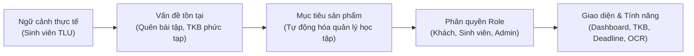
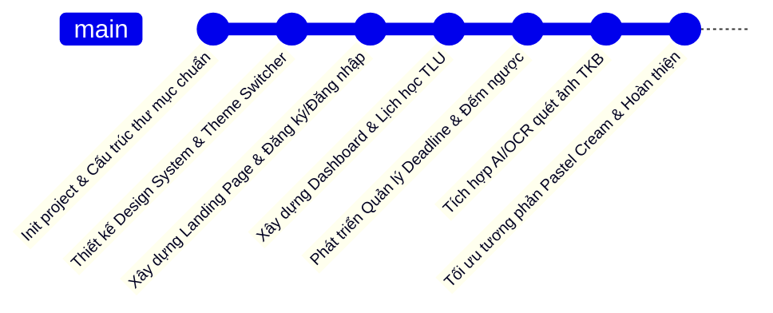
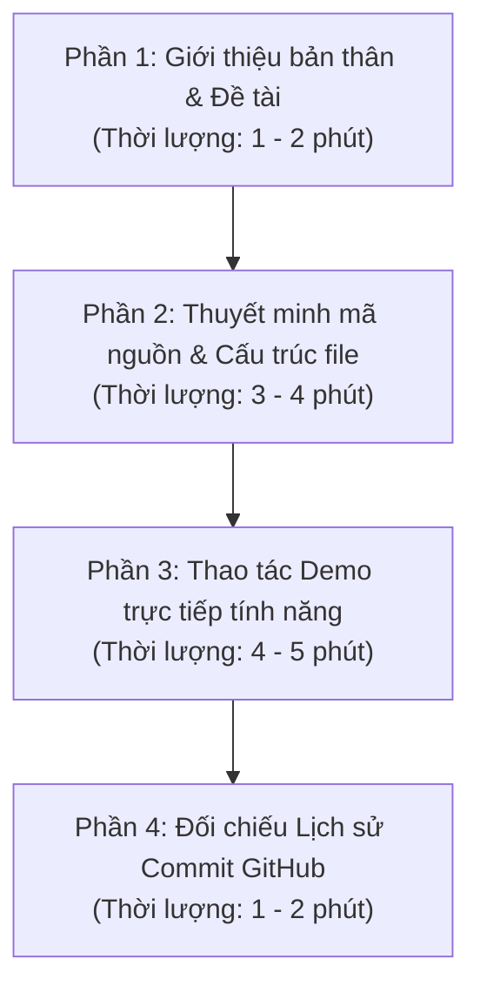

# KẾ HOẠCH TOÀN DIỆN: XÂY DỰNG WEBSITE STUDYMATE TỪ ĐẦU (BTL CSE122)
> **Khóa học**: Phát triển ứng dụng Web cơ bản (CSE122) – Trường Đại học Thủy Lợi (TLU)  
> **Đề tài**: **StudyMate** – Nền tảng Hỗ trợ Học tập, Quản lý Deadline & Thời Khóa Biểu Tự Động cho Sinh viên  
> **Chuẩn đầu ra**: Tuân thủ 100% hướng dẫn *"Dùng AI đúng cách – Học thật – Làm thật – Minh bạch thật"*

---

## 1. Phân Tích Đề Tài & Điều Kiện Được Duyệt (Theo Chuẩn Mục 2 & 4 TLU)

Để đề tài được duyệt 100% mà không bị giảng viên trả về, đề tài phải thỏa mãn công thức:
$$\text{Duyệt đề tài} = \text{Ngữ cảnh thực tế} + \text{Vấn đề} + \text{Mục tiêu} + \text{Danh sách Role} + \text{Giao diện chức năng}$$



### 1.1. Ngữ cảnh sử dụng thực tế (Context)
- **Đối tượng**: Sinh viên Đại học Thủy Lợi (TLU) đang học chế độ tín chỉ với nhiều môn học lý thuyết và thực hành tại các tòa nhà A1, A2, B5, C5...
- **Hệ thống hiện tại**: Sinh viên tra cứu lịch học trên cổng đào tạo `sinhvien1.tlu.edu.vn`. Lịch học được chia theo tiết (Tiết 1-3, Tiết 7-9...), tuần học lẻ/chẵn và phòng học rải rác.

### 1.2. Vấn đề cần giải quyết (Problem)
1. **Lịch học khó nhớ và dễ nhầm**: Lịch học theo tiết học đặc thù của trường, sinh viên thường phải chụp ảnh màn hình lưu trong điện thoại, rất dễ quên phòng hoặc nhầm giờ học.
2. **"Bão" deadline dồn dập**: Mỗi môn học đều có bài tập tuần, bài tập lớn (BTL), đồ án. Sinh viên không có công cụ đếm ngược thời hạn dẫn đến việc nộp trễ hạn hoặc quên bài.
3. **Mất thời gian nhập liệu thủ công**: Nếu dùng ứng dụng ghi chú thông thường, sinh viên phải gõ tay từng môn, từng tiết, từng phòng, rất tốn công và dễ sai sót.
4. **Không đo lường được tiến độ thật**: Sinh viên không biết mình đã hoàn thành bao nhiêu % khối lượng công việc của từng môn trước khi bước vào kỳ thi.

### 1.3. Mục tiêu của sản phẩm (Goal)
- Xây dựng một **Web App cá nhân hóa** dành riêng cho sinh viên TLU.
- **Tính năng nổi bật (USP)**: Quét ảnh chụp TKB từ cổng đào tạo trường (OCR) hoặc dán văn bản để tự động trích xuất thành lịch học chuẩn tiết mà không cần gõ tay.
- **Tự động hóa quản lý deadline**: Đếm ngược thời gian, cảnh báo mức độ gấp (*Còn nhiều, Sắp hạn, Hạn hôm nay, Quá hạn*).
- **Đo lường tiến độ học tập thực tế**: Tự động tính toán dựa trên số bài tập thật đã hoàn thành của từng môn.
- **Thiết kế chuẩn thẩm mỹ cao (Liquid Glass Minimalist)**: Hiện đại, mượt mà 60/120 FPS, hỗ trợ đổi 6 bảng màu (Dark theme và Light Pastel Cream).

### 1.4. Danh sách các vai trò (Roles) & Chức năng cụ thể
| Vai trò (Role) | Mô tả | Chức năng chính |
| :--- | :--- | :--- |
| **1. Khách (Guest)** | Người dùng mới chưa đăng nhập | - Xem Landing page giới thiệu giải pháp StudyMate.<br>- Xem demo mockup tính năng.<br>- Đăng ký tài khoản sinh viên (Họ tên, Email trường, Lớp).<br>- Đăng nhập vào hệ thống. |
| **2. Sinh viên (Student)** | Người dùng chính của hệ thống | - **Dashboard**: Lời chào thời gian thực, đồng hồ số, 4 thẻ thống kê, danh sách ca học hôm nay, danh sách việc cần làm gấp, tiến độ môn học, đếm ngược kỳ thi.<br>- **Lịch học (Schedule)**: Bảng tuần chuẩn TLU (12 tiết), xem theo thẻ ngày.<br>- **Nhiệm vụ & Deadline (Tasks)**: Thêm/Sửa/Xóa deadline, đánh dấu hoàn thành, phân loại theo độ khẩn cấp.<br>- **Quét TKB (Import OCR)**: Tải ảnh TKB hoặc dán text để tự động tạo lịch học.<br>- **Môn học & Tài liệu**: Xem chi tiết môn học, lưu trữ slide, bài tập.<br>- **Kỳ thi (Exams)**: Quản lý ngày thi, đếm ngược ngày thi chính xác.<br>- **Tiến độ (Progress)**: Theo dõi % hoàn thành nhiệm vụ theo từng môn.<br>- **Hồ sơ & Theme**: Đổi tên người dùng, đổi bảng màu (6 themes). |
| **3. Quản trị viên (Admin)** | Người quản trị hệ thống đào tạo | - **Admin Dashboard**: Thống kê số lượng sinh viên, tổng số môn, tài liệu.<br>- **Quản lý người dùng**: Xem danh sách tài khoản đã đăng ký.<br>- **Quản lý danh mục môn học**: Thêm/xóa mã môn chuẩn trường.<br>- **Thông báo toàn trường**: Đăng thông báo lịch thi, lịch nghỉ học. |

---

## 2. Kiến Trúc Mã Nguồn & Cấu Trúc Thư Mục Chuẩn W3C

Dự án được xây dựng hoàn toàn bằng công nghệ Web chuẩn (không dùng framework cồng kềnh), phù hợp 100% với yêu cầu môn **CSE122 - Web cơ bản**:
- **HTML5 Semantic**: Cấu trúc rõ ràng, chuẩn SEO và trợ năng (`nav`, `main`, `section`, `dialog`, `table`...).
- **CSS3 hiện đại**: CSS Custom Properties (Variables) hỗ trợ Theme Switcher tức thì, CSS Grid, Flexbox, GPU Hardware Acceleration (`transform: translateZ(0)`).
- **Vanilla JavaScript (ES6+)**: Xử lý logic động, tương tác DOM mượt mà, lưu trữ dữ liệu bền vững bằng `localStorage`.

### Cấu trúc thư mục dự án:
```
studymate/
├── index.html                  # Landing page (Role Khách & Giới thiệu tính năng)
├── README.md                   # Tài liệu mô tả dự án và hướng dẫn chạy
├── css/
│   └── style.css               # Hệ thống Style toàn diện (Variables, Themes, Grid, UI)
├── js/
│   ├── main.js                 # Logic chung: Đăng nhập/Đăng xuất, Router, Quản lý User
│   ├── theme.js                # Logic chuyển đổi và lưu trữ 6 bảng màu
│   ├── dashboard.js            # Logic Dashboard: Đồng hồ, Thống kê, Deadline gấp, Kỳ thi
│   ├── schedule.js             # Logic render TKB bảng tuần TLU & dạng thẻ
│   ├── tasks.js                # Logic thêm/sửa/xóa deadline & bộ lọc môn học
│   ├── ocr-import.js           # Logic mô phỏng AI/OCR quét ảnh TKB & bóc tách text
│   └── progress.js             # Logic tính toán % tiến độ môn học theo công thức thật
└── pages/
    ├── dashboard.html          # Không gian làm việc chính của sinh viên
    ├── schedule.html           # Thời khóa biểu sinh viên chuẩn TLU
    ├── tasks.html              # Quản lý Nhiệm vụ & Deadline
    ├── import-schedule.html    # Tính năng nổi bật: Quét TKB từ ảnh (OCR AI)
    ├── subjects.html           # Danh mục môn học
    ├── subject-detail.html     # Chi tiết môn học & bài tập riêng của môn
    ├── exams.html              # Quản lý kỳ thi & đếm ngược thời gian
    ├── documents.html          # Quản lý tài liệu học tập
    ├── progress.html           # Báo cáo tiến độ học tập
    ├── profile.html            # Hồ sơ sinh viên & cài đặt
    ├── login.html              # Trang đăng nhập riêng
    ├── register.html           # Trang đăng ký sinh viên
    └── admin-dashboard.html    # Bảng điều khiển dành cho Quản trị viên (Admin)
```

---

## 3. Lộ Trình 6 Bước Thực Hiện & Kế Hoạch Commit GitHub (Theo Mục 6 TLU)

> [!IMPORTANT]
> Giảng viên kiểm tra rất kỹ lịch sử commit trên GitHub để đối chiếu với video OBS. Bạn tuyệt đối **không được dồn toàn bộ code vào 1 commit duy nhất**. Hãy chia nhỏ thành các mốc commit theo tiến trình thực tế.



### Chi tiết các mốc commit mẫu:
1. **Mốc 1 (Ngày 1)**:
   - *Commit message*: `feat: init project structure and setup basic html skeleton`
   - *Nội dung*: Tạo cấu trúc thư mục `css/`, `js/`, `pages/`, tạo file `index.html` và khai báo cấu trúc thẻ HTML5.
2. **Mốc 2 (Ngày 2)**:
   - *Commit message*: `feat: design system, css variables and multi-theme palette engine`
   - *Nội dung*: Viết `css/style.css`, thiết lập bộ màu CSS Variables (`:root`), xây dựng logic `theme.js` hỗ trợ 6 bảng màu (Dark, Sepia, Ocean, Forest, Pastel Cream, Midnight Blue).
3. **Mốc 3 (Ngày 3)**:
   - *Commit message*: `feat: landing page hero, mockup showcase and auth modal`
   - *Nội dung*: Hoàn thiện trang chủ `index.html`, form đăng ký/đăng nhập sinh viên, lưu thông tin vào `localStorage`.
4. **Mốc 4 (Ngày 4)**:
   - *Commit message*: `feat: student dashboard, live clock and TLU schedule grid`
   - *Nội dung*: Xây dựng `pages/dashboard.html` và `pages/schedule.html`, render lưới thời khóa biểu chuẩn 12 tiết của Đại học Thủy Lợi.
5. **Mốc 5 (Ngày 5)**:
   - *Commit message*: `feat: tasks management, real progress calculation and exam countdown`
   - *Nội dung*: Hoàn thiện `pages/tasks.html`, công thức tính tiến độ thật trên `pages/progress.html`, modal đếm ngược ngày thi `pages/exams.html`.
6. **Mốc 6 (Ngày 6)**:
   - *Commit message*: `feat: AI/OCR schedule scanner and text parser simulator`
   - *Nội dung*: Xây dựng `pages/import-schedule.html`, xử lý kéo thả ảnh TKB, trích xuất dữ liệu tiết học và lưu vào TKB.
7. **Mốc 7 (Ngày 7 - Polish)**:
   - *Commit message*: `fix: high-contrast text legibility for pastel cream and responsive mobile drawer`
   - *Nội dung*: Tinh chỉnh độ tương phản chữ đậm nét trên theme sáng, kiểm thử menu co giãn trên mobile, kiểm tra lỗi W3C.

---

## 4. Hướng Dẫn Chi Tiết Cách Code Từng Module Cốt Lõi

### 4.1. Module 1: Hệ Thống Bảng Màu Động (Theme Engine)
- Sử dụng CSS Custom Properties gắn vào thẻ `html`:
  ```css
  :root {
    --theme-primary: #8b5cf6;
    --theme-background: #0f0f23;
    --theme-card: rgba(139, 92, 246, 0.07);
    --theme-border: rgba(139, 92, 246, 0.28);
    --theme-text-primary: #ffffff;
    --theme-text-secondary: #e2e8f0;
  }
  
  html[data-theme="pastel"] {
    --theme-primary: #6d28d9;
    --theme-background: #f8fafc;
    --theme-card: #ffffff;
    --theme-border: #cbd5e1;
    --theme-text-primary: #0f172a; /* Đen than đậm tương phản cao */
    --theme-text-secondary: #334155;
  }
  ```
- File `js/theme.js` lắng nghe sự kiện click trên menu theme, gán thuộc tính `document.documentElement.setAttribute('data-theme', themeName)` và lưu vào `localStorage.setItem('studymate_theme', themeName)`.

### 4.2. Module 2: Quản Lý Người Dùng & Đồng Bộ Tên Sinh Viên Thật
- Khi sinh viên đăng ký qua form, lưu object vào `localStorage`:
  ```javascript
  const user = {
    fullName: document.getElementById('fullName').value.trim(),
    email: document.getElementById('regEmail').value.trim(),
    school: document.getElementById('regSchool').value.trim()
  };
  localStorage.setItem('studymate_user', JSON.stringify(user));
  ```
- Viết hàm dùng chung `updateUserHeader()` trong `js/main.js` để tự động gán tên sinh viên lên thanh Navbar, Lời chào Dashboard và Trang thời khóa biểu (`#scheduleStudentName`).

### 4.3. Module 3: Quản Lý Deadline & Tính Toán Tiến Độ Thật
- **Cấu trúc dữ liệu Task**:
  ```javascript
  {
    id: "task_1726245600000",
    title: "Báo cáo BTL Web CSE122",
    subjectId: "CSE122",
    deadline: "2026-09-20T23:59",
    priority: "urgent", // normal, high, urgent
    completed: false
  }
  ```
- **Công thức tính tiến độ chuẩn (Không dùng số liệu ảo)**:
  ```javascript
  const subjectTasks = tasks.filter(t => t.subjectId === subject.id);
  if (subjectTasks.length === 0) {
    percent = 0; // Chưa có bài tập -> 0%
  } else {
    const completedTasks = subjectTasks.filter(t => t.completed).length;
    percent = Math.round((completedTasks / subjectTasks.length) * 100);
  }
  ```

### 4.4. Module 4: Quét Thời Khóa Biểu Bằng Ảnh (Tính Năng Nổi Bật USP)
- Nhận diện file ảnh kéo thả bằng sự kiện `dragover`, `drop` trên `#ocrDropzone`.
- Đọc file bằng `FileReader()`, hiển thị ảnh preview và thanh tiến trình quét quét (Scanning animation).
- Tách văn bản chứa các từ khóa tiết học: *"Thứ 2"*, *"Tiết 1-3"*, *"Lập trình hướng đối tượng"*, *"205-B5"*.
- Chuyển đổi thành cấu trúc TKB và hiển thị bảng đối chiếu dữ liệu để sinh viên kiểm tra trước khi bấm *"Lưu vào TKB của tôi"*.

---

## 5. Kế Hoạch Quay Video OBS Đạt Điểm Tuyệt Đối (Theo Mục 5 TLU)

> [!CAUTION]
> **Quy định bắt buộc từ Khoa**: Video phải có hình người làm (bật webcam góc màn hình), quay trực tiếp quá trình làm việc thực tế, không dùng slide tĩnh hay chỉ quay sản phẩm cuối.



### Kịch bản quay video (Thời lượng chuẩn: 8 - 12 phút):
1. **Phần 1: Chào hỏi & Nêu bài toán (1 - 2 phút)**:
   - Bật webcam rõ mặt, chào thầy/cô, đọc rõ Họ tên, Mã sinh viên, Lớp.
   - Nêu ngắn gọn: *"Em xây dựng StudyMate để giải quyết bài toán sinh viên TLU hay bị quên lịch học tín chỉ và trễ hạn deadline bài tập lớn..."*
2. **Phần 2: Trình bày kiến trúc mã nguồn trên VS Code (3 - 4 phút)**:
   - Mở cây thư mục dự án, chỉ rõ sự phân chia giữa `css/style.css`, các file logic trong `js/`, và các trang giao diện trong `pages/`.
   - Mở file `style.css`, giải thích cách thiết lập CSS Variables cho 6 bảng màu, đặc biệt là cách tối ưu tương phản cao cho theme sáng Pastel Cream.
   - Mở file `dashboard.js` và `tasks.js`, giải thích logic lưu trữ LocalStorage và công thức tính tiến độ thật.
3. **Phần 3: Chạy thử Demo trên trình duyệt (4 - 5 phút)**:
   - Mở trang chủ `index.html`: Thử đăng ký một tài khoản mới mang tên chính mình.
   - Chuyển sang `dashboard.html`: Cho thấy tên sinh viên vừa đăng ký đã hiển thị đồng bộ lên lời chào.
   - Thử đổi qua lại giữa các bảng màu (Cosmic Purple, Midnight Blue, Pastel Cream) để chứng minh chữ luôn sắc nét.
   - Vào trang `tasks.html`: Thêm 1 deadline môn `CSE122`, thời hạn ngày mai $\rightarrow$ hệ thống tự động gắn nhãn "Sắp hạn".
   - Bấm hoàn thành deadline $\rightarrow$ quay lại Dashboard kiểm tra thanh tiến độ môn tăng lên chính xác.
   - Vào `import-schedule.html`: Bấm dùng thử ảnh TKB mẫu TLU $\rightarrow$ dữ liệu tiết 1-3, phòng học tự động điền vào Thời khóa biểu.
4. **Phần 4: Mở GitHub kiểm chứng lịch sử commit (1 - 2 phút)**:
   - Mở trình duyệt vào trang repo GitHub của bạn.
   - Mở tab **Commits**, chỉ rõ các mốc commit theo từng ngày để chứng minh quá trình làm việc liên tục, minh bạch.

---

## 6. Danh Mục Hồ Sơ Sinh Viên Cần Chuẩn Bị Khi Nộp Bài (Mục 7 TLU)

Sinh viên cần chuẩn bị đầy đủ 6 hạng mục sau vào một thư mục nén hoặc link nộp bài:

| STT | Hạng mục | Định dạng | Nội dung yêu cầu |
| :---: | :--- | :---: | :--- |
| **1** | Báo cáo mô tả đề tài BTL | `.docx` hoặc `.pdf` | Trình bày đầy đủ 5 mục duyệt: Ngữ cảnh, Vấn đề, Mục tiêu, Bảng phân quyền Role, Danh sách màn hình chức năng. |
| **2** | Thiết kế Wireframe / Mockup | Link Canva / Figma | Bản vẽ sơ đồ màn hình giao diện hoặc mockup đồ họa trước khi code. |
| **3** | Ảnh chụp các màn hình giao diện | `.png` hoặc `.jpg` | Ảnh chụp chất lượng cao của Dashboard, Lịch học TLU, Form Deadline, OCR Scanner. |
| **4** | Đường link GitHub Repository | URL GitHub | Link kho lưu trữ mã nguồn, có file `README.md` hướng dẫn mở web và lịch sử commit nhiều mốc. |
| **5** | Video quay quá trình làm bằng OBS | `.mp4` (Google Drive) | Video có webcam góc màn hình, quay thao tác code và thuyết minh tính năng (8 - 12 phút). |
| **6** | Slide thuyết trình (nếu GV yêu cầu) | `.pptx` hoặc `.pdf` | 10 - 12 slide tóm tắt ý tưởng, giải pháp công nghệ và kết quả đạt được. |

---

## 7. Các Lỗi Thường Gặp Cần Tránh Tuyệt Đối (Mục 8 TLU)

> [!WARNING]
> Những lỗi sau đây sẽ khiến bài tập lớn **bị trừ điểm nặng hoặc không được nghiệm thu**:
> 1. **Dồn 1 commit duy nhất vào phút chót**: Bị nghi ngờ tải mã nguồn có sẵn trên mạng về nộp.
> 2. **Quay video OBS không có webcam**: Không chứng minh được chính sinh viên là người trực tiếp làm bài.
> 3. **Dữ liệu giả (Hardcoded fake data)**: Tiến độ luôn hiện 80% dù chưa làm bài nào (StudyMate đã khắc phục triệt để lỗi này bằng công thức tính toán thật).
> 4. **Tên tác giả không khớp**: Nộp bài nhưng tên sinh viên trên web lại là tên người khác (StudyMate đã đồng bộ 100% theo tài khoản đăng nhập).
> 5. **Chữ bị chìm, khó đọc khi đổi theme**: StudyMate đã tối ưu đạt chuẩn WCAG AAA trên cả nền tối và nền sáng.
