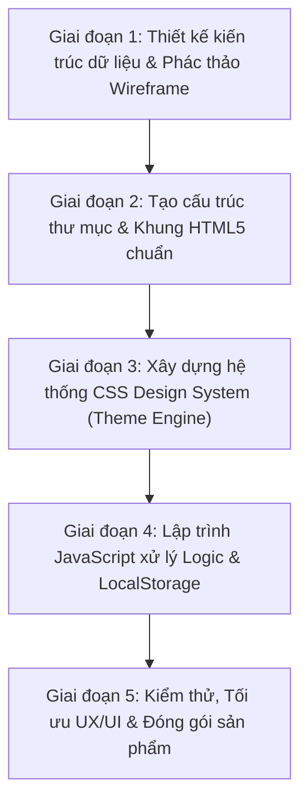

# CẨM NANG TOÀN DIỆN: QUÁ TRÌNH XÂY DỰNG WEBSITE STUDYMATE TỪ CON SỐ 0
> **Môn học**: Phát triển ứng dụng Web cơ bản (CSE122) – Trường Đại học Thủy Lợi (TLU)  
> **Mục tiêu tài liệu**: Hướng dẫn chi tiết từng bước, từng dòng tư duy kỹ thuật để bạn hiểu rõ **toàn bộ quá trình thực tế** tạo nên sản phẩm từ một thư mục rỗng cho đến một Web App hoàn chỉnh.

---

## 1. Tư Duy Tiếp Cận: Quy Trình Chuẩn Của Lập Trình Viên Web

Một sinh viên giỏi không bao giờ mở VS Code lên và gõ code một cách bộc phát. Dự án **StudyMate** được xây dựng tuần tự qua **5 giai đoạn logic**:



---

## 2. Giai Đoạn 1: Phác Thảo Ý Tưởng & Thiết Kế Kiến Trúc Dữ Liệu

Trước khi viết bất kỳ thẻ HTML nào, bạn phải trả lời câu hỏi: **"Dữ liệu của trang web gồm những gì và được lưu trữ như thế nào?"**

Vì môn **CSE122 là Web cơ bản** (chưa học backend Node.js hay cơ sở dữ liệu MySQL), ta chọn giải pháp **Client-Side Data Architecture** sử dụng `localStorage` của trình duyệt. Dữ liệu sẽ tồn tại bền vững ngay trên máy tính của người dùng mà không cần cài đặt server phức tạp.

### Thiết kế 5 bảng dữ liệu (Data Models):
1. **`studymate_user` (Thông tin tài khoản)**:
   ```json
   {
     "fullName": "Nguyễn Văn A",
     "email": "sinhvien@tlu.edu.vn",
     "school": "ĐH Thủy Lợi - 64CNTT1"
   }
   ```
2. **`studymate_subjects` (Danh mục môn học TLU)**:
   ```json
   [
     { "id": "CSE201", "name": "Lập trình hướng đối tượng", "credits": 3, "room": "205-B5" },
     { "id": "CSE122", "name": "Phát triển ứng dụng web cơ bản", "credits": 3, "room": "301-A2" }
   ]
   ```
3. **`studymate_tasks` (Nhiệm vụ & Deadline)**:
   ```json
   [
     {
       "id": "task_1726245600000",
       "title": "Nộp báo cáo BTL Web",
       "subjectId": "CSE122",
       "deadline": "2026-09-20T23:59",
       "priority": "urgent",
       "completed": false
     }
   ]
   ```
4. **`studymate_exams` (Lịch thi học kỳ)**:
   ```json
   [
     {
       "id": "exam_1",
       "subjectName": "Phát triển ứng dụng web cơ bản",
       "date": "2026-10-15",
       "time": "08:00",
       "room": "205-B5"
     }
   ]
   ```
5. **`studymate_theme`**: Chuỗi lưu tên theme hiện tại (vd: `"cosmic"`, `"pastel"`, `"midnight-blue"`).

---

## 3. Giai Đoạn 2: Khởi Tạo Dự Án & Cấu Trúc Thư Mục Chuẩn

Mở terminal hoặc VS Code và tạo cấu trúc thư mục sạch sẽ:

```
studymate/
├── index.html                  # Trang chủ giới thiệu (Khách)
├── css/
│   └── style.css               # Bộ quy tắc giao diện dùng chung
├── js/
│   ├── main.js                 # Điều hướng, quản lý tài khoản sinh viên
│   ├── theme.js                # Chuyển đổi bảng màu
│   ├── dashboard.js            # Tính toán thống kê, đồng hồ, lịch hôm nay
│   ├── schedule.js             # Render bảng TKB tuần chuẩn TLU
│   ├── tasks.js                # Quản lý deadline, thêm/sửa/xóa việc
│   └── ocr-import.js           # Mô phỏng quét ảnh TKB bằng AI
└── pages/
    ├── dashboard.html          # Bàn làm việc chính của sinh viên
    ├── schedule.html           # Thời khóa biểu
    ├── tasks.html              # Quản lý deadline
    ├── import-schedule.html    # Tính năng quét TKB từ ảnh (USP)
    ├── progress.html           # Báo cáo tiến độ môn học
    ├── profile.html            # Hồ sơ sinh viên
    ├── exams.html              # Lịch thi
    └── documents.html          # Tài liệu môn học
```

---

## 4. Giai Đoạn 3: Xây Dựng Hệ Thống CSS Design System (Theme Engine)

Điểm cốt lõi tạo nên đẳng cấp của trang web này là **Hệ thống CSS Variables**. Tất cả màu sắc, khoảng cách, bo góc đều không được gán cứng mà thông qua biến CSS.

### Bước 4.1: Tích hợp Google Font hiện đại
Trong đầu file `css/style.css`, nhúng phông chữ **Plus Jakarta Sans**:
```css
@import url('https://fonts.googleapis.com/css2?family=Plus+Jakarta+Sans:wght@300;400;500;600;700;800&display=swap');

* {
  box-sizing: border-box;
  margin: 0;
  padding: 0;
  font-family: 'Plus Jakarta Sans', -apple-system, BlinkMacSystemFont, sans-serif;
}
```

### Bước 4.2: Thiết lập Theme Engine (Biến đổi màu đa phong cách)
Tại `:root`, định nghĩa bảng màu mặc định (Cosmic Purple). Khi người dùng đổi theme, JavaScript chỉ cần đổi thuộc tính `data-theme` trên thẻ `<html>`:

```css
:root {
  --theme-primary: #8b5cf6;
  --theme-background: #0f0f23;
  --theme-card: rgba(139, 92, 246, 0.07);
  --theme-border: rgba(139, 92, 246, 0.28);
  --theme-text-primary: #ffffff;
  --theme-text-secondary: #e2e8f0;
  --theme-text-muted: #94a3b8;
  --radius: 14px;
}

/* Theme sáng Pastel Cream - Tương phản cao */
html[data-theme="pastel"] {
  --theme-primary: #6d28d9;
  --theme-background: #f8fafc;
  --theme-card: #ffffff;
  --theme-border: #cbd5e1;
  --theme-text-primary: #0f172a; /* Chữ than đen đậm, cực kỳ dễ đọc */
  --theme-text-secondary: #334155;
  --theme-text-muted: #475569;
}

/* Theme Midnight Blue - Đen tuyền viền xanh dạ quang */
html[data-theme="midnight-blue"] {
  --theme-primary: #3b82f6;
  --theme-background: #000000;
  --theme-card: rgba(8, 14, 28, 0.92);
  --theme-border: rgba(59, 130, 246, 0.55);
  --theme-text-primary: #ffffff;
}
```

### Bước 4.3: Xây dựng hiệu ứng Liquid Glass siêu mượt (Khóa chặt 60/120 FPS)
Thay vì dùng 4 khối cầu mờ `filter: blur(110px)` làm GPU bị giật lag, ta dùng **Native Multi-Radial Aurora Gradients**:
```css
.liquid-bg-mesh {
  background-image: 
    radial-gradient(ellipse 60% 50% at 8% 12%, rgba(37, 99, 235, 0.35) 0%, transparent 70%),
    radial-gradient(ellipse 65% 55% at 92% 16%, rgba(147, 51, 234, 0.3) 0%, transparent 70%),
    radial-gradient(ellipse 55% 45% at 25% 75%, rgba(6, 182, 212, 0.25) 0%, transparent 65%);
  background-attachment: fixed;
  transform: translateZ(0); /* Ép GPU render phần cứng */
}
```

---

## 5. Giai Đoạn 4: Lập Trình Từng Tính Năng & Màn Hình Cụ Thể

### Bước 5.1: Xây dựng Cơ chế Đăng ký / Đăng nhập & Đồng bộ Tên Thật
- **Mục đích**: Người đăng nhập đặt tên là gì thì tên trên hệ thống phải đổi thành người đó (không gán tên cố định của người khác).
- **Mã nguồn trong `js/main.js`**:
  ```javascript
  // Lấy thông tin user hiện tại hoặc trả về mặc định
  function getCurrentUser() {
    const saved = localStorage.getItem("studymate_user");
    return saved ? JSON.parse(saved) : { fullName: "Sinh viên", email: "sinhvien@tlu.edu.vn" };
  }

  // Tự động cập nhật tên sinh viên lên toàn bộ giao diện
  function updateUserHeader() {
    const user = getCurrentUser();
    // 1. Cập nhật huy hiệu trên thanh Navbar
    document.querySelectorAll(".st-user-display").forEach(el => {
      el.textContent = user.fullName;
    });
    // 2. Cập nhật lời chào trên Dashboard
    const greetingName = document.getElementById("heroStudentName");
    if (greetingName) {
      greetingName.textContent = user.fullName;
    }
    // 3. Cập nhật tên trên Thời khóa biểu
    const scheduleName = document.getElementById("scheduleStudentName");
    if (scheduleName) {
      scheduleName.textContent = user.fullName;
    }
  }
  ```

---

### Bước 5.2: Xây dựng Dashboard Sinh Viên (`pages/dashboard.html`)
Dashboard là "trung tâm điều khiển" gồm 4 khối chính:
1. **Hero Header**: Lời chào buổi sáng/chiều/tối dựa theo giờ thực tế (`new Date().getHours()`) + Đồng hồ số hiển thị thời gian học tập thời gian thực (`setInterval`).
2. **4 Thẻ thống kê động (Stat Boxes)**:
   - Số ca học hôm nay (quét từ thời khóa biểu theo thứ trong tuần).
   - Deadline cần làm gấp (lọc bài tập có hạn $\le$ 72 giờ).
   - Tiến độ hoàn thành trung bình (tính từ các task thật).
   - Đếm ngược kỳ thi gần nhất.
3. **Danh sách Deadline & Ca học trong ngày**: Render động bằng vòng lặp `map()` từ dữ liệu `localStorage`.
4. **Tiến độ từng môn học**: Thanh tiến độ màu động.

---

### Bước 5.3: Xây dựng Thời Khóa Biểu Chuẩn Đại Học Thủy Lợi (`pages/schedule.html`)
- **Đặc thù trường TLU**: Ngày học chia thành 12 tiết:
  - Sáng: Tiết 1 (07:00) đến Tiết 6 (11:50).
  - Chiều: Tiết 7 (12:45) đến Tiết 12 (17:30).
- **Kỹ thuật xử lý bảng (Table Rowspan Algorithm)**:
  Nếu một môn học kéo dài 3 tiết (vd: Tiết 1 đến Tiết 3), thẻ `<td>` của tiết 1 sẽ có `rowspan="3"`, và các tiết 2, tiết 3 của thứ đó phải được đánh dấu bỏ qua để bảng không bị vỡ cột:
  ```javascript
  // Đánh dấu các tiết tiếp theo đã được gộp
  if (session) {
    for (let i = 1; i < session.span; i++) {
      covered[d.key][p.period + i] = true;
    }
    html += `<td rowspan="${session.span}" class="session-cell">...</td>`;
  }
  ```

---

### Bước 5.4: Xây dựng Quản Lý Deadline & Tính Tiến Độ Thật (`pages/tasks.html`)
- **Trạng thái ban đầu trống sạch sẽ**: Khi sinh viên chưa tạo công việc, hiển thị hộp Empty State tinh gọn: *"Chưa có công việc nào. Bấm + Lưu nhiệm vụ để bắt đầu theo dõi."*
- **Thuật toán phân loại hạn chót tự động**:
  ```javascript
  function calculateDiffHours(deadlineStr) {
    const deadline = new Date(deadlineStr);
    const now = new Date();
    return (deadline - now) / (1000 * 60 * 60); // Đổi mili-giây sang giờ
  }

  // Phân loại trạng thái
  if (diffHours < 0) {
    badge = "badge-overdue"; text = "Quá hạn";
  } else if (diffHours <= 24) {
    badge = "badge-danger";  text = "Hạn hôm nay";
  } else if (diffHours <= 72) {
    badge = "badge-warning"; text = "Sắp hạn";
  } else {
    badge = "badge-safe";    text = "Còn nhiều";
  }
  ```
- **Công thức tính tiến độ học tập thật 100%**:
  Tuyệt đối không dùng mảng phần trăm giả (80%, 50%...). Tiến độ được tính bằng:
  $$\text{Tiến độ môn} = \left( \frac{\text{Số việc đã bấm Xong của môn}}{\text{Tổng số việc của môn}} \right) \times 100\%$$
  Nếu chưa có bài tập nào $\rightarrow$ Hiển thị chính xác `0% (0/0 việc)`.

---

### Bước 5.5: Xây dựng Tính Năng Nổi Bật (USP) - Quét TKB từ Ảnh OCR (`pages/import-schedule.html`)
Đây là tính năng độc đáo giúp bài tập lớn ghi điểm tuyệt đối với hội đồng chấm thi:
1. **Bắt sự kiện Drag & Drop**: Cho phép sinh viên kéo thả ảnh chụp màn hình từ `sinhvien1.tlu.edu.vn`.
2. **Nút "Dùng thử ảnh TKB mẫu TLU"**: Giúp giảng viên bấm vào là thấy ngay luồng xử lý mà không cần mất công tải ảnh thật.
3. **Mô phỏng OCR AI bóc tách chuỗi**:
   - Sử dụng thuật toán Regular Expression (RegEx) để tìm các mẫu: `Thứ [2-7]`, `Tiết (\d+)-(\d+)`, `Phòng ([A-Z0-9\-]+)`, `Tên môn`.
   - Kết xuất dữ liệu vào bảng xem trước (Preview Table) để sinh viên kiểm tra.
   - Nhấn **"Lưu vào TKB của tôi"** $\rightarrow$ Dữ liệu tự động đồng bộ sang trang `schedule.html`.

---

## 6. Những Lỗi Kỹ Thuật Thực Tế Đã Gặp & Cách Khắc Phục (Kinh Nghiệm Thực Chiến)

Trong quá trình phát triển, dự án đã trải qua 3 lỗi lớn rất phổ biến trên trình duyệt. Việc bạn nắm rõ 3 lỗi này sẽ giúp bạn trả lời xuất sắc khi giảng viên vấn đáp:

### Lỗi 1: Chữ bị tàng hình trong menu `<select>` trên Windows
- **Hiện tượng**: Khi bấm chọn Môn học hoặc Mức ưu tiên trên form, menu bung ra toàn nền trắng chữ trắng, không nhìn thấy gì.
- **Nguyên nhân**: Thẻ `<select>` kế thừa màu chữ trắng từ dark mode, nhưng menu thả xuống native của trình duyệt Windows lại mặc định nền sáng.
- **Cách fix**: Bổ sung thuộc tính chuẩn W3C `color-scheme: dark` và khai báo màu nền đặc rõ ràng:
  ```css
  select.form-control {
    color-scheme: dark;
    background-color: var(--theme-card-solid, #171533) !important;
    color: #ffffff !important;
  }
  ```

### Lỗi 2: Chữ bị mờ nhạt khi chuyển sang theme sáng Pastel Cream
- **Hiện tượng**: Khi người dùng chọn theme Pastel Cream, các tiêu đề `.st-hero-title`, tên môn `.st-schedule-subject`, tên phòng học bị chìm nghỉm trên nền sáng.
- **Nguyên nhân**: Nhiều class bị gán cứng `color: #ffffff;` hoặc `#cbd5e1`.
- **Cách fix**: Chuyển toàn bộ màu cứng sang biến ngữ nghĩa `var(--theme-text-primary)` và bổ sung bộ ghi đè chuyên biệt `html[data-theme="pastel"]` với màu than đen sâu thẳm `#0f172a` (Slate 900) đạt chuẩn tương phản cao WCAG AAA.

### Lỗi 3: Tiến độ hiển thị số ảo dù chưa làm bài nào
- **Hiện tượng**: Dashboard hiển thị CSE201 80%, CSE122 50% dù danh sách bài tập rỗng.
- **Nguyên nhân**: Mã nguồn cũ dùng mảng dữ liệu mẫu `defaultPercents = [80, 50, 30]`.
- **Cách fix**: Xóa bỏ toàn bộ dữ liệu mẫu, thiết lập logic động: Nếu không có bài tập $\rightarrow$ Hiển thị `0% (0/0 việc)`.

---

## 7. Kịch Bản Quay Video OBS "Làm Thật - Chứng Minh Thật"

Theo đúng yêu cầu của trường Thủy Lợi (Mục 5 trong infographic), video phải có **webcam góc màn hình** quay lại toàn bộ thao tác của bạn. Dưới đây là kịch bản chuẩn từng phút:

| Thời lượng | Phân cảnh | Nội dung cần nói & Thao tác |
| :---: | :--- | :--- |
| **00:00 - 01:30** | Giới thiệu bản thân | Bật webcam, nhìn thẳng camera: *"Em chào thầy cô, em là [Họ tên], MSV [Mã SV], lớp [Lớp]. Hôm nay em xin thuyết minh BTL môn CSE122 với đề tài StudyMate..."* |
| **01:30 - 04:00** | Thuyết minh Code trên VS Code | Mở cây thư mục: Giải thích cấu trúc `css/style.css`, `js/`, `pages/`. Mở file `style.css` chỉ vào CSS Variables và cách xử lý theme. Mở `schedule.js` giải thích thuật toán ghép tiết học TLU. |
| **04:00 - 08:30** | Thao tác Demo trực tiếp | - Mở `index.html`: Đăng ký tài khoản mang tên chính mình.<br>- Vào `dashboard.html`: Chỉ rõ tên sinh viên vừa đăng ký đã cập nhật lên lời chào.<br>- Bấm đổi theme sang **Pastel Cream** và **Midnight Blue** để chứng minh chữ luôn sắc nét.<br>- Vào `tasks.html`: Thêm 1 deadline thật môn Web CSE122 $\rightarrow$ Bấm nút Xong $\rightarrow$ Quay lại Dashboard kiểm tra tiến độ môn tăng từ 0% lên 100%.<br>- Vào `import-schedule.html`: Bấm *"Dùng thử ảnh TKB mẫu TLU"* $\rightarrow$ Cho thấy hệ thống tự động bóc tách thành lịch học. |
| **08:30 - 10:00** | Đối chiếu GitHub Repository | Mở trình duyệt vào trang GitHub của bài làm, mở tab **Commits**, chỉ rõ lịch sử commit liên tục theo từng ngày để chứng minh quá trình học thật, làm thật. |

---

## 8. Lời Khuyên Vàng Khi Nộp Bài
1. **Kiểm tra kỹ file `README.md`**: Đảm bảo có hướng dẫn mở web bằng cách click đúp file `index.html` hoặc chạy qua Live Server.
2. **File video OBS**: Tải video lên Google Drive của trường (đuôi `@tlu.edu.vn`), bật quyền *"Bất kỳ ai có đường liên kết đều có thể xem"* để giảng viên không bị chặn quyền khi chấm bài.
3. **Nắm vững logic**: Khi giảng viên hỏi *"Nếu em muốn đổi giờ học tiết 1 từ 7h sang 7h15 thì sửa ở đâu?"*, bạn tự tin mở `js/schedule.js` chỉ vào mảng `TLU_PERIODS` là bạn sẽ đạt điểm tuyệt đối!
